# UK Biobank tools

How to use:

* Run help command `Rscript ukb-exe.r -h`

  ```cmd
  ukb-exe v0.1 (2020-01-12)
  
  Usage: Rscript ukb-exe.r [functions] [options] <-b> <-t>
  
  Functions:
      --ukb_prune | -pr  This is a first function for automated pruning for UKB data.
      --ukb_excld | -ex  This is a second function for select eid for further 
      				   analysis, such as correlation table and linear regression
                         model.
  
  Global arguments:
      --base      | -b   Base RDS files are mendatory.
      --target    | -t   Target_dir or target_file is mendatory.
      --verbose   | -v   Rich description for debugging. Default is FALSE.
  
  Running functions without arguments prints usage information for [functions].
  ```


## 1. ukb_prune

* Run help command `Rscript ukb-exe.r --ukb_prune -h`

```cmd
ukb-exe v0.1 (2020-01-12)

Usage: Rscript ukb-exe.r --ukb_prune [options] <--base|-b> <--target|-t>
    --ukb_prune | -pr  This is a first function for automated pruning for UKB data.

Required arguments:
    -b <1.rds 2.rds 3.rds>
                       Three base RDS files are needed: 
                       * 1.rds: A RDS file for UKB phenotypes. This is a
                           directly downloaded file from the UK biobank.
                       * 2.rds: A RDS file for UKB field ID description.
                       * 3.rds: A RDS file for UKB field ID code information.
                       Please keep the file order!
    -t <target_dir target_file.rds>
                       Two variables are needed for target directory/RDS file:
                       * target_dir: A target directory address for save figures
                       * target_file.rds: A target file for result phenotype table.
                       Please keep the dir/file order!

Either one of these are required:
    --fids <fid1 fid2 ...>
                       Fid numbers, a subset of field IDs to extract reliable
                       subjects.
    --anns <Reproductive_Aging / Longevity / Confounders>
                       Either Reproductive_Aging/Longevity/Confounders,
                       an annotation for a subset of field IDs in UKB field
                       description file (e.g., db_UKB/ukb_id_info.csv.rds),
                       including Reproductive_Aging, Longevity, and Confounders

Optional arguments:
    --expt             Fid numbers, a subset of field IDs as exception for filtering.
```

Usage examples for ukb_prune:

1. Longevity

   ```cmd
   Rscript ukb-exe.r -pr -v -b db_UKB/ukb38640.csv.rds db_UKB/ukb_fid_info.csv.rds db_UKB/ukb_fid_code.csv.rds -t fig_UKB/prune_lon data_UKB/ukb_prune_lon.rds -anns Longevity -expt 1845 2946 40007 > data_UKB/ukb_prune_lon.rds_log.txt
   ```

   * input RDS files
     * `db_UKB/ukb38640.csv.rds`: ukb phenotype data (downloaded from UKB)
     * `db_UKB/ukb_fid_info.csv.rds`: ukb field ID information file (manually generated)
     * `db_UKB/ukb_fid_code.csv.rds`: ukb field ID code information file (manually generated)
   * `-anns Longevity`
   * `-expt 1845 2946 40007`: exceptionally fids
     * 1845: Mother's age, values are keep increasing because of their alive, Just select latest data
     * 2946: Father's age, values are keep increasing because of their alive, Just select latest data
     * 40007: Age at death, answer difference distribution is not following normal distribution. And the differences are less than -0.05~0.05 years range, which is likely very small.
   * `> data_UKB/ukb_prune_lon.rds_log.txt` save messages to a designated file

2. Reproductive aging

   ```cmd
   Rscript ukb-exe.r -pr -v -b db_UKB/ukb38640.csv.rds db_UKB/ukb_fid_info.csv.rds db_UKB/ukb_fid_code.csv.rds -t fig_UKB/prune_rep data_UKB/ukb_prune_rep.rds -anns Reproductive_Aging > data_UKB/ukb_prune_rep.rds_log.txt
   ```

   * `-anns Reproductive_Aging`
   * `> data_UKB/ukb_prune_rep.rds_log.txt` save messages to a designated file

3. Confounders

   ```cmd
   Rscript ukb-exe.r -pr -v -b db_UKB/ukb38640.csv.rds db_UKB/ukb_fid_info.csv.rds db_UKB/ukb_fid_code.csv.rds -t fig_UKB/prune_con data_UKB/ukb_prune_con.rds -anns Confounders > data_UKB/ukb_prune_con.rds_log.txt
   ```

   * `-anns Confounders`
   * `> data_UKB/ukb_prune_con.rds_log.txt` save messages to a designated file

4. Additional

   * fid1767 Adopted as a child

     ```cmd
     Rscript ukb-exe.r -pr -v -b db_UKB/ukb38640.csv.rds db_UKB/ukb_fid_info.csv.rds db_UKB/ukb_fid_code.csv.rds -t fig_UKB/prune_con2 data_UKB/ukb_prune_con2.rds --fids 1767 > data_UKB/ukb_prune_con2.rds_log.txt
     ```

   * fid21022 Age at recruitment

     ```cmd
     Rscript ukb-exe.r -pr -v -b db_UKB/ukb25461.csv.rds db_UKB/ukb_fid_info.csv.rds db_UKB/ukb_fid_code.csv.rds -t fig_UKB/prune_con2 data_UKB/ukb_prune_con2_21022.rds --fids 21022 > data_UKB/ukb_prune_con2_21022.rds_log.txt
     ```


## 2. ukb_excld

* Run help command `Rscript ukb-exe.r --ukb_prune -h`

```
ukb-exe v0.1 (2020-01-12)

Usage: Rscript ukb-exe.r --ukb_excld [options] <-b> <-t>
    --ukb_excld | -ex  This is a second function for select eid for further analysis,
                       such as correlation table and linear regression model.

Required arguments:
    -b <1.rds>         One base RDS file is needed:
                       * 1.rds: A RDS file for UKB phenotypes. This is a result file
                           from the ukb_prune function.
    -t <target_dir target_file.rds>
                       Two variables are needed for target directory/RDS file.
    --fids <fid1 fid2 fid3 ...>
                       Fid numbers, a subset of field IDs to extract subjects.
                       If there are three fids, this function will automatically
                       select eids having the no[0] answers from the first fid (data
                       type should be categorical). Then select union eids from
                       the second and third fids, which data types should be 
                       continuous or integer.
                       * ex1) setdiff(Oophorectomy_no, union(Oophorectomy_yes,
                           Oophorectomy_age))
                       * ex2) setdiff(HRT_no, union(HRT_yes, HRT_start, HRT_end))
                       * In case of multiple categorial data is not considered yet.

Optional arguments:
	--cutoff <num1 num2>
	                   If data type is continuous or integer, setting cutoff criteria
	                   such as age at menarche: <9 or >20 years.
	--cat_no           True/False argument for select "No" answers from categorial
	                   data.
```

Usage examples for ukb_excld:

1. Filtering Menarche

   ```cmd
   Rscript ukb-exe.r --ukb_excld -v -b data_UKB/ukb_prune_rep.rds --fids fid2714 --cutoff 9 20 -t data_UKB/eid_fid2714.csv > data_UKB/eid_fid2714.csv_log.txt
   ```

   * fid2714 Age when periods started (menarche)
   * pruned and filtered outliers by <9 or >20 years old
   * messages saved at `data_UKB/eid_fid2714.csv_log.txt`

2. Filtering Menopause

   ```cmd
   Rscript ukb-exe.r --ukb_excld -v -b data_UKB/ukb_prune_rep.rds --fids fid3581 --cutoff 40 60 -t data_UKB/eid_fid3581.csv > data_UKB/eid_fid3581.csv_log.txt
   ```

   * fid3581 Age at menopause (last menstrual period)
   * pruned and filtered outliers by <40 or >60 years old
   * messages saved at `data_UKB/eid_fid3581.csv_log.txt`

3. setdiff Hysterectomy

   ```cmd
   Rscript ukb-exe.r --ukb_excld -v -b data_UKB/ukb_prune_rep.rds --fids fid3591 fid2824 --cat_no -t data_UKB/eid_fid3591.csv > data_UKB/eid_fid3591.csv_log.txt
   ```

   * fid3591 Ever had hysterectomy (womb removed): Yes or No
     * fid2824 Age at hysterectomy: Integer, years
     * setdiff(fid3591 No, union(fid3591 Yes, fid2824) )
   * messages saved at `data_UKB/eid_fid3591.csv_log.txt`

4. setdiff Bilateral oophorectomy

   ```cmd
   Rscript ukb-exe.r --ukb_excld -v -b data_UKB/ukb_prune_rep.rds --fids fid2834 fid3882 --cat_no -t data_UKB/eid_fid2834.csv > data_UKB/eid_fid2834.csv_log.txt
   ```

   * fid2834 Bilateral oophorectomy (both ovaries removed): Yes or No
     * fid3882 Age at bilateral oophorectomy (both ovaries removed): Integer, years
     * setdiff(fid2834 No, union(fid2834 Yes, fid3882) )
   * messages saved at `data_UKB/eid_fid2834.csv_log.txt`

5. setdiff Hormone-replacement therapy (HRT)

   ```cmd
   Rscript ukb-exe.r --ukb_excld -v -b data_UKB/ukb_prune_rep.rds --fids fid2814 fid3536 fid3546 --cat_no -t data_UKB/eid_fid2814.csv > data_UKB/eid_fid2814.csv_log.txt
   ```

   * fid2814 Ever used hormone-replacement therapy (HRT)
     * fid3536, Age started hormone-replacement therapy (HRT)
     * fid3546, Age last used hormone-replacement therapy (HRT)
   * messages saved at `data_UKB/eid_fid2814.csv_log.txt`

   To identify the subjects who don't had hysterectomy, bilateral oophorectomy, and hormone-replacement therapy (HRT), exclude answers of ever had question is Yes as well as data existing in ages at hyterectomy, bilateral oophorectomy, and HRT.


# Age-related diseases: ICD-10 code

## 1. Calculating ICD-10 background incidence

Preparing total incidence of ICD-10 data as background. Save the result as RDS file for later use.

```R
library(dplyr)

# Read data
master6 <- readRDS("Jinhee Code/master_6.rds")
master6_icd10 = subset(master6,ICD9.ICD10=='ICD10')
ICD10_Code_ann = read.delim('ICD10_DataCoding_41270.tsv')

# Calculate the total incidence of ICD-10
source('10. Automation_ICD10_UKB.r')
total_icd10_freq = original(
    master6_icd10, 
    code_num=NULL, 
    ICD10_Code_ann, 
    totalage_freq=NULL, 
    subgroup=FALSE)[[1]]

# Save as RDS file
saveRDS(total_icd10_freq,'total_icd10_freq.rds')

# Create barplot of total ICD-10 disease incidences
total_icd10_freq_vec = total_icd10_freq$Frequency
names(total_icd10_freq_vec) = total_icd10_freq$`Age at Diagnosis`
png('fig/total_icd10_freq.png')
barplot(total_icd10_freq_vec,main='Total ICD-10 incidences',xlab='Age at Diagnosis')
dev.off()
```


### Example 1: Age-related diseases


This is the plot from UKB self-reported data.

Draw incidence rate plot for major age-relaed diseases and its subgroups.

```R
source('10. Automation_ICD10_UKB.r')
dis = c("G30", "E11", "E14", "I21", "I22", "I50", "I64", "J44")
f_dir = 'fig'

for(i in 1:length(dis)) {
    # Prepare data
    inc_rate = original(master6,dis[i],ICD10_Code_ann,200,total_icd10_freq,TRUE)
    inc_norm = normalized(master6,dis[i],ICD10_Code_ann,200,total_icd10_freq,TRUE)

    # Draw plots
    dataplotting(inc_rate,logbase=10,age_min=40,age_max=80,f_dir)
    dataplotting(inc_norm,logbase=10,age_min=40,age_max=80,f_dir)
}
```

[ISSUE] Why background start late? <- Check!

| Disease                                                      | Incidence rate               | Normalized incidence rate      |
| ------------------------------------------------------------ | ---------------------------- | ------------------------------ |
| G30 Alzheimer's disease (AD)                                 | 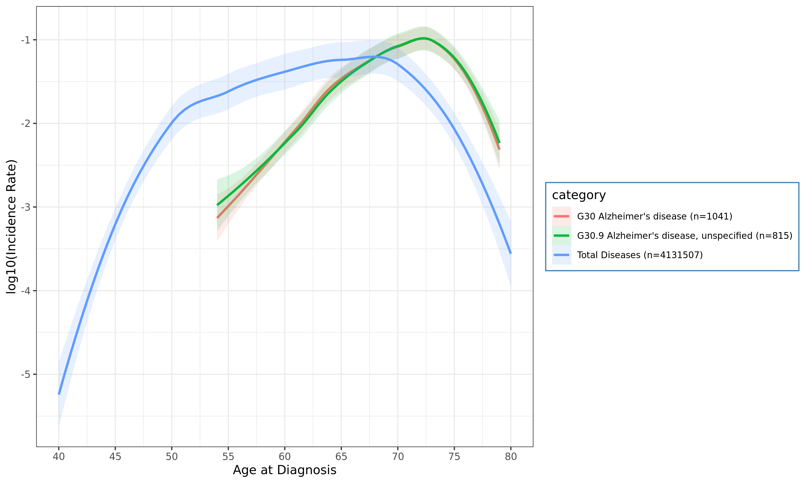 | 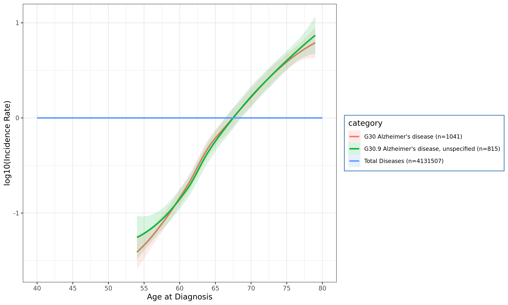 |
| I50 Heart failure (CHF)                                      | 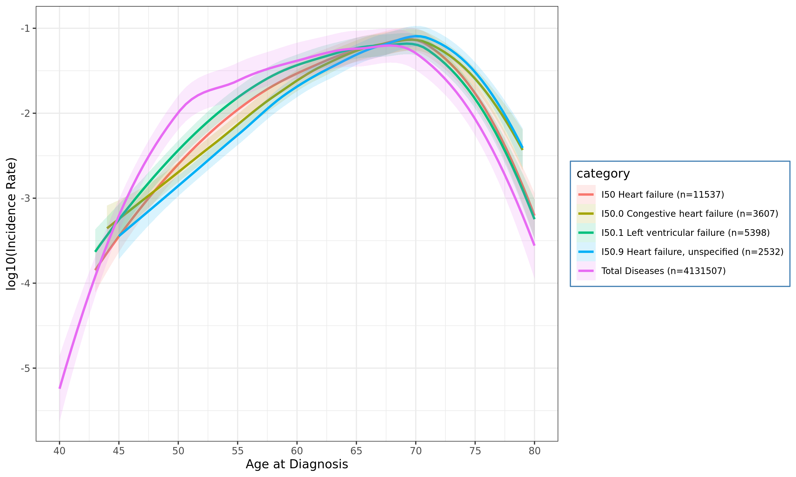 | 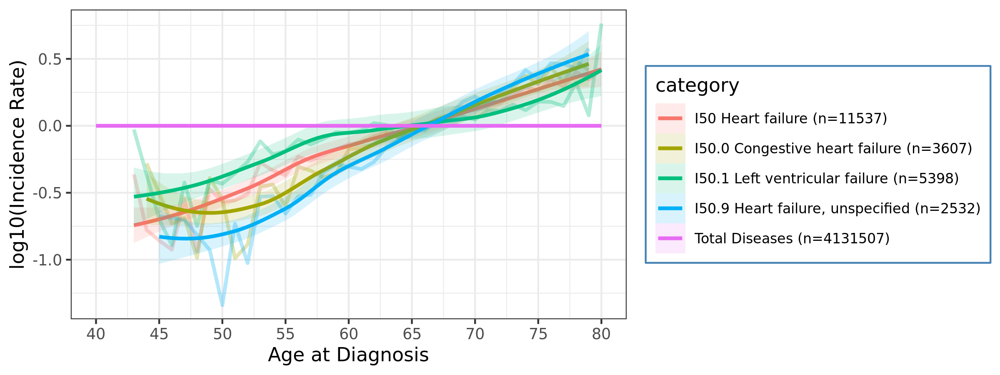 |
| J44 Other chronic obstructive pulmonary disease (COPD)       | No plot (N<200)              | No plot (N<200)                |
| I21 Acute myocardial infarction (Acute MI)                   | 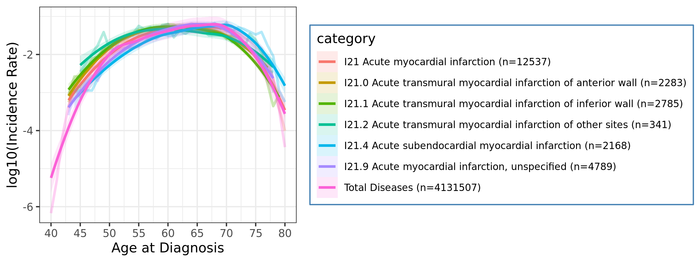 | 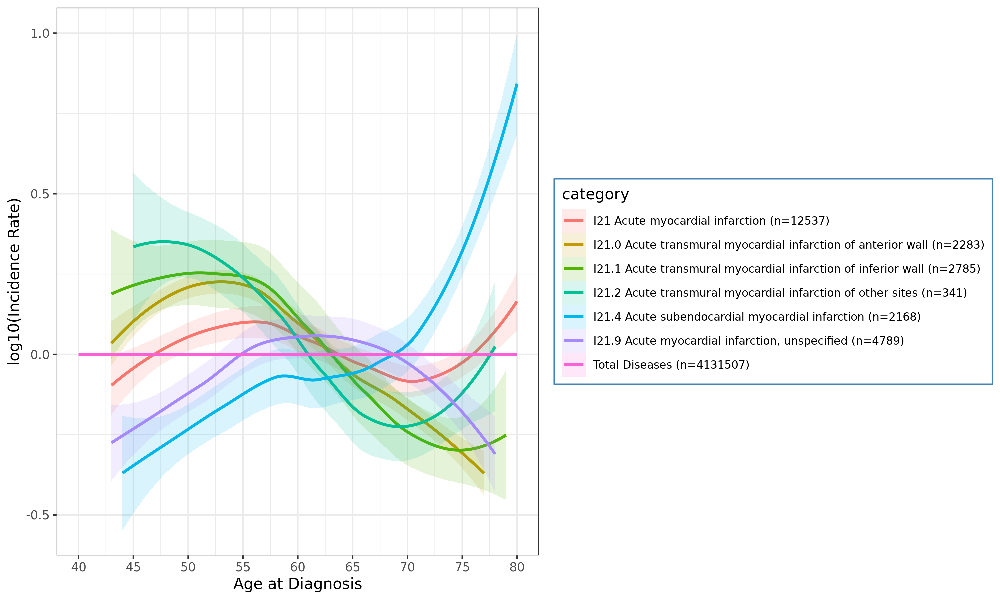 |
| I22 Subsequent myocardial infarction (Subsequent MI)         | 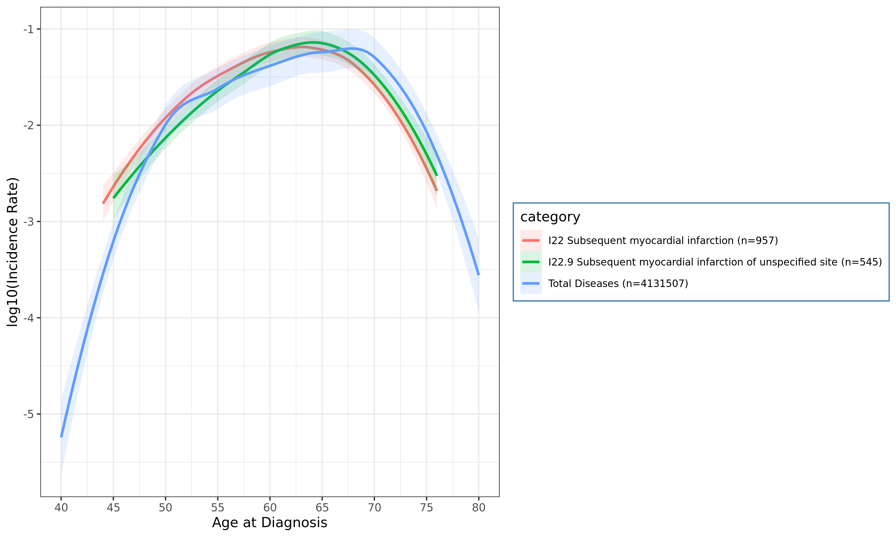 | 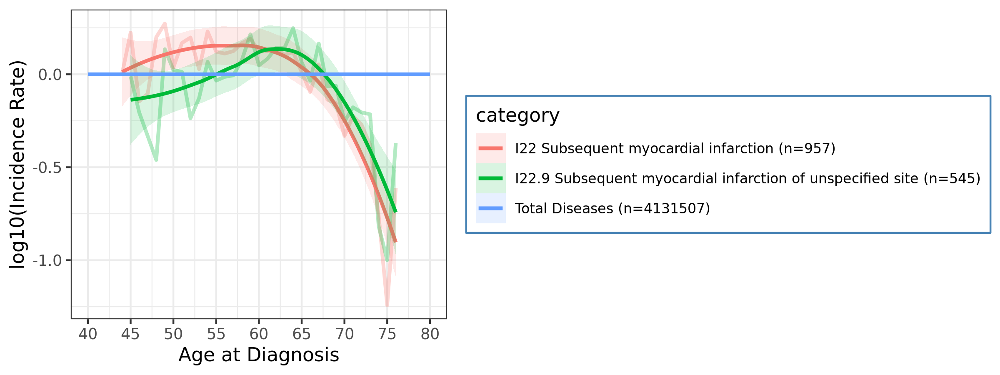 |
| I64 Stroke, not specified as haemorrhage or infarction  1432 | No plot (N<200)              | No plot (N<200)                |
| E11 Non-insulin-dependent diabetes mellitus (Diabetes Type II) | 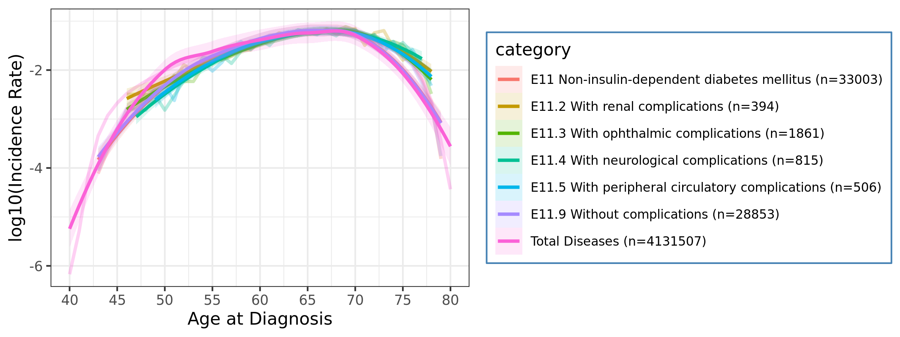 | 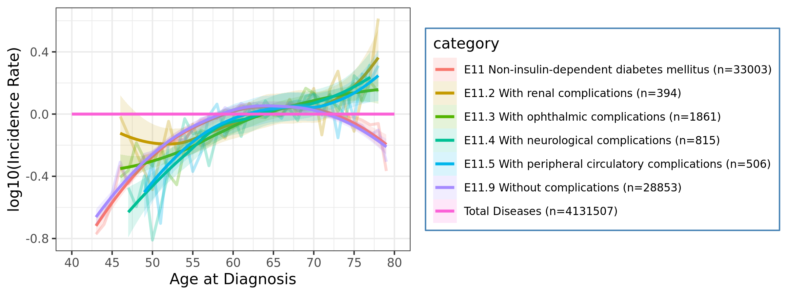 |
| E14 Unspecified diabetes mellitus (Unspecified Diabetes)     | 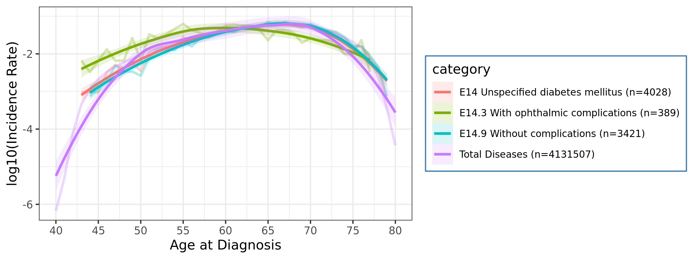 | 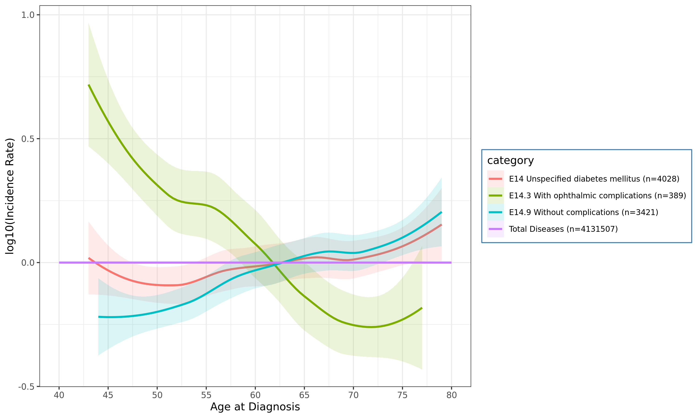 |


## 2. Preprocessing for ICD-10

Calculating incidence of each ICD10 codes.

```R
library(dplyr)

# Read data
#totalage_freq = readRDS('Jinhee Code/totalage_freq.rds')
master6          = readRDS("Jinhee Code/master_6.rds")
master6_icd10    = subset(master6,ICD9.ICD10=='ICD10')
ICD10_Code_ann   = read.delim('ICD10_DataCoding_41270.tsv')
total_icd10_freq = readRDS('total_icd10_freq.rds')

# Calculate normalized incidence rate of ICD10
icd10 = master6_icd10$Disease_Code %>% as.character %>% unique %>% sort

# Run clustering_preprocess
## Minimum incidence criteria: 200
source('10. Automation_ICD10_UKB.r')
clust_result = clustering_preprocess(
    master         = master6_icd10,
    code_num       = icd10,
    ICD10_Code_ann = ICD10_Code_ann,
    totalage_freq  = total_icd10_freq,
    subgroup       = FALSE)

saveRDS(clust_result,'clust_result_icd10.rds')

# debugging for 6963/11726 O16
#source('10. Automation_ICD10_UKB.r'); clust_result = clustering_preprocess(master6_icd10, "O16", ICD10_Code_ann, total_icd10_freq, FALSE)
```

> ** Run clustering_preprocess **
>
> Processing 11726 iterations:
>
>
>   100/11726 A392 Job process: 33.9 sec
>
>   200/11726 B000 Job process: 1.1 min
>
> ...
>
>   11600/11726 Z851 Job process: 1.3 hr
>
>   11700/11726 Z961 Job process: 1.3 hr
>
> Merging data = 41  2090 -> done
>
> Job done: 2021-02-13 20:31:55 for 1.3 hr


## 3. Draw heatmap of ICD-10 normalized incidences

* [See R color palette](https://kbroman.files.wordpress.com/2014/05/crayons.png)
* `library(colorspace)` [ref](https://www.r-bloggers.com/2019/01/colorspace-new-tools-for-colors-and-palettes/), [fig](https://i2.wp.com/eeecon.uibk.ac.at/~zeileis/assets/posts/2019-01-14-colorspace/hcl-palettes-1.png?ssl=1)

```R
library(dplyr)

# Read data
clust_result = readRDS('clust_result_icd10.rds')

# Prepare sub-sets
## clust_result:  41 2089; original data
## clust_result2: 41  873; peak age over 60
## clust_result3: 36  784; peak age over 60 & remove top 1 and bottom 2 rows (< 1,500 incidences)
source('10. Automation_ICD10_UKB.r')
clust_result2 = subsetting_cluster_result(clust_result, 0,0, 60)
clust_result3 = subsetting_cluster_result(clust_result, 4,2, 60)
```

Draw total 2,089 ICD-10 diseases heatmap

```R
col_fun = colorRamp2(c(0,1,2,3,4), c("white","Sky Blue","yellow Green","yellow","red"))
png('fig/clust_result.png', width=25,height=8, units='in', res=150)
Heatmap(clust_result, cluster_rows = FALSE, col = col_fun)
dev.off()
```

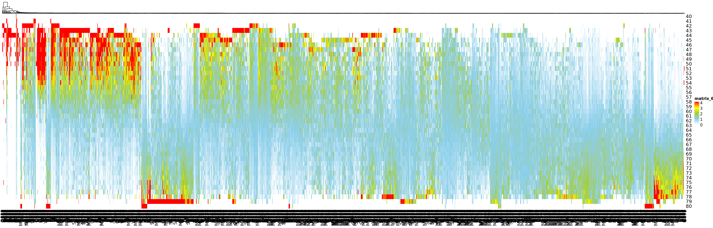

Draw 873 diseases filtered by peak age after 60 years

```R
col_fun = colorRamp2(c(0,1,2,3,4), c("white","Sky Blue","yellow Green","yellow","red"))
png('fig/clust_result_peak60.png', width=25,height=8, units='in', res=150)
Heatmap(clust_result2, cluster_rows = FALSE, col = col_fun)
dev.off()
```

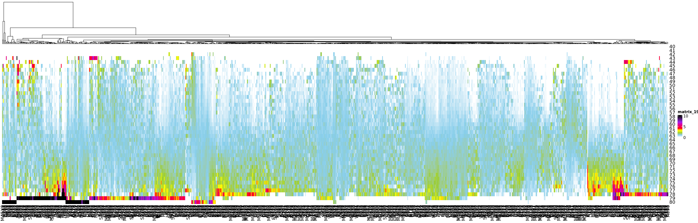

Draw 784 diseases with peak age after 60 years and removed top 4 and bottom 2 rows (< 1,500 incidences)

```R
# set configurations
i = 3
wh = c(25,8)
col_split = c(8,12,20)
f_name = paste0('fig/clust_result_peak60_2,4trimed_',col_split[i],'.png')
col_fun = colorRamp2(c(0,1,2,3,4), c("white","Sky Blue","yellow Green","yellow","red"))

# Draw heatmaps
png(f_name, width=25,height=8, units='in', res=150)
Heatmap(clust_result3, cluster_rows = FALSE, col = col_fun, column_split = col_split[i])
dev.off()

# Kill all graphics objects
graphics.off()
```

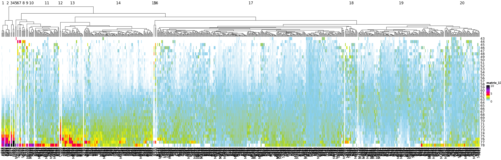


## 4. Extract clustered data


# Age-related diseases: Phecode

## 1. Calculating phecode background incidence

