# UK Biobank tools

How to use:

* Run help command `Rscript ukb-exe.r -h`

  ```cmd
  ukb-exe v0.1 (2020-01-12)
  
  Usage: Rscript ukb-exe.r [functions] [options] <-b> <-t>
  
  Functions:
      --ukb_prune | -pr  This is a first function for automated pruning for UKB data.
      --ukb_excld | -ex  This is a second function for select eid for further 
      				   analysis, such as correlation table and linear regression
                         model.
  
  Global arguments:
      --base      | -b   Base RDS files are mendatory.
      --target    | -t   Target_dir or target_file is mendatory.
      --verbose   | -v   Rich description for debugging. Default is FALSE.
  
  Running functions without arguments prints usage information for [functions].
  ```


## 1. ukb_prune

* Run help command `Rscript ukb-exe.r --ukb_prune -h`

```cmd
ukb-exe v0.1 (2020-01-12)

Usage: Rscript ukb-exe.r --ukb_prune [options] <--base|-b> <--target|-t>
    --ukb_prune | -pr  This is a first function for automated pruning for UKB data.

Required arguments:
    -b <1.rds 2.rds 3.rds>
                       Three base RDS files are needed: 
                       * 1.rds: A RDS file for UKB phenotypes. This is a
                           directly downloaded file from the UK biobank.
                       * 2.rds: A RDS file for UKB field ID description.
                       * 3.rds: A RDS file for UKB field ID code information.
                       Please keep the file order!
    -t <target_dir target_file.rds>
                       Two variables are needed for target directory/RDS file:
                       * target_dir: A target directory address for save figures
                       * target_file.rds: A target file for result phenotype table.
                       Please keep the dir/file order!

Either one of these are required:
    --fids <fid1 fid2 ...>
                       Fid numbers, a subset of field IDs to extract reliable
                       subjects.
    --anns <Reproductive_Aging / Longevity / Confounders>
                       Either Reproductive_Aging/Longevity/Confounders,
                       an annotation for a subset of field IDs in UKB field
                       description file (e.g., db_UKB/ukb_id_info.csv.rds),
                       including Reproductive_Aging, Longevity, and Confounders

Optional arguments:
    --expt             Fid numbers, a subset of field IDs as exception for filtering.
```

Usage examples for ukb_prune:

1. Longevity

   ```cmd
   Rscript ukb-exe.r -pr -v -b db_UKB/ukb38640.csv.rds db_UKB/ukb_fid_info.csv.rds db_UKB/ukb_fid_code.csv.rds -t fig_UKB/prune_lon data_UKB/ukb_prune_lon.rds -anns Longevity -expt 1845 2946 40007 > data_UKB/ukb_prune_lon.rds_log.txt
   ```

   * input RDS files
     * `db_UKB/ukb38640.csv.rds`: ukb phenotype data (downloaded from UKB)
     * `db_UKB/ukb_fid_info.csv.rds`: ukb field ID information file (manually generated)
     * `db_UKB/ukb_fid_code.csv.rds`: ukb field ID code information file (manually generated)
   * `-anns Longevity`
   * `-expt 1845 2946 40007`: exceptionally fids
     * 1845: Mother's age, values are keep increasing because of their alive, Just select latest data
     * 2946: Father's age, values are keep increasing because of their alive, Just select latest data
     * 40007: Age at death, answer difference distribution is not following normal distribution. And the differences are less than -0.05~0.05 years range, which is likely very small.
   * `> data_UKB/ukb_prune_lon.rds_log.txt` save messages to a designated file

2. Reproductive aging

   ```cmd
   Rscript ukb-exe.r -pr -v -b db_UKB/ukb38640.csv.rds db_UKB/ukb_fid_info.csv.rds db_UKB/ukb_fid_code.csv.rds -t fig_UKB/prune_rep data_UKB/ukb_prune_rep.rds -anns Reproductive_Aging > data_UKB/ukb_prune_rep.rds_log.txt
   ```

   * `-anns Reproductive_Aging`
   * `> data_UKB/ukb_prune_rep.rds_log.txt` save messages to a designated file

3. Confounders

   ```cmd
   Rscript ukb-exe.r -pr -v -b db_UKB/ukb38640.csv.rds db_UKB/ukb_fid_info.csv.rds db_UKB/ukb_fid_code.csv.rds -t fig_UKB/prune_con data_UKB/ukb_prune_con.rds -anns Confounders > data_UKB/ukb_prune_con.rds_log.txt
   ```

   * `-anns Confounders`
   * `> data_UKB/ukb_prune_con.rds_log.txt` save messages to a designated file

4. Additional

   * fid1767 Adopted as a child

     ```cmd
     Rscript ukb-exe.r -pr -v -b db_UKB/ukb38640.csv.rds db_UKB/ukb_fid_info.csv.rds db_UKB/ukb_fid_code.csv.rds -t fig_UKB/prune_con2 data_UKB/ukb_prune_con2.rds --fids 1767 > data_UKB/ukb_prune_con2.rds_log.txt
     ```

   * fid21022 Age at recruitment

     ```cmd
     Rscript ukb-exe.r -pr -v -b db_UKB/ukb25461.csv.rds db_UKB/ukb_fid_info.csv.rds db_UKB/ukb_fid_code.csv.rds -t fig_UKB/prune_con2 data_UKB/ukb_prune_con2_21022.rds --fids 21022 > data_UKB/ukb_prune_con2_21022.rds_log.txt
     ```


## 2. ukb_excld

* Run help command `Rscript ukb-exe.r --ukb_prune -h`

```
ukb-exe v0.1 (2020-01-12)

Usage: Rscript ukb-exe.r --ukb_excld [options] <-b> <-t>
    --ukb_excld | -ex  This is a second function for select eid for further analysis,
                       such as correlation table and linear regression model.

Required arguments:
    -b <1.rds>         One base RDS file is needed:
                       * 1.rds: A RDS file for UKB phenotypes. This is a result file
                           from the ukb_prune function.
    -t <target_dir target_file.rds>
                       Two variables are needed for target directory/RDS file.
    --fids <fid1 fid2 fid3 ...>
                       Fid numbers, a subset of field IDs to extract subjects.
                       If there are three fids, this function will automatically
                       select eids having the no[0] answers from the first fid (data
                       type should be categorical). Then select union eids from
                       the second and third fids, which data types should be 
                       continuous or integer.
                       * ex1) setdiff(Oophorectomy_no, union(Oophorectomy_yes,
                           Oophorectomy_age))
                       * ex2) setdiff(HRT_no, union(HRT_yes, HRT_start, HRT_end))
                       * In case of multiple categorial data is not considered yet.

Optional arguments:
	--cutoff <num1 num2>
	                   If data type is continuous or integer, setting cutoff criteria
	                   such as age at menarche: <9 or >20 years.
	--cat_no           True/False argument for select "No" answers from categorial
	                   data.
```

Usage examples for ukb_excld:

1. Filtering Menarche

   ```cmd
   Rscript ukb-exe.r --ukb_excld -v -b data_UKB/ukb_prune_rep.rds --fids fid2714 --cutoff 9 20 -t data_UKB/eid_fid2714.csv > data_UKB/eid_fid2714.csv_log.txt
   ```

   * fid2714 Age when periods started (menarche)
   * pruned and filtered outliers by <9 or >20 years old
   * messages saved at `data_UKB/eid_fid2714.csv_log.txt`

2. Filtering Menopause

   ```cmd
   Rscript ukb-exe.r --ukb_excld -v -b data_UKB/ukb_prune_rep.rds --fids fid3581 --cutoff 40 60 -t data_UKB/eid_fid3581.csv > data_UKB/eid_fid3581.csv_log.txt
   ```

   * fid3581 Age at menopause (last menstrual period)
   * pruned and filtered outliers by <40 or >60 years old
   * messages saved at `data_UKB/eid_fid3581.csv_log.txt`

3. setdiff Hysterectomy

   ```cmd
   Rscript ukb-exe.r --ukb_excld -v -b data_UKB/ukb_prune_rep.rds --fids fid3591 fid2824 --cat_no -t data_UKB/eid_fid3591.csv > data_UKB/eid_fid3591.csv_log.txt
   ```

   * fid3591 Ever had hysterectomy (womb removed): Yes or No
     * fid2824 Age at hysterectomy: Integer, years
     * setdiff(fid3591 No, union(fid3591 Yes, fid2824) )
   * messages saved at `data_UKB/eid_fid3591.csv_log.txt`

4. setdiff Bilateral oophorectomy

   ```cmd
   Rscript ukb-exe.r --ukb_excld -v -b data_UKB/ukb_prune_rep.rds --fids fid2834 fid3882 --cat_no -t data_UKB/eid_fid2834.csv > data_UKB/eid_fid2834.csv_log.txt
   ```

   * fid2834 Bilateral oophorectomy (both ovaries removed): Yes or No
     * fid3882 Age at bilateral oophorectomy (both ovaries removed): Integer, years
     * setdiff(fid2834 No, union(fid2834 Yes, fid3882) )
   * messages saved at `data_UKB/eid_fid2834.csv_log.txt`

5. setdiff Hormone-replacement therapy (HRT)

   ```cmd
   Rscript ukb-exe.r --ukb_excld -v -b data_UKB/ukb_prune_rep.rds --fids fid2814 fid3536 fid3546 --cat_no -t data_UKB/eid_fid2814.csv > data_UKB/eid_fid2814.csv_log.txt
   ```

   * fid2814 Ever used hormone-replacement therapy (HRT)
     * fid3536, Age started hormone-replacement therapy (HRT)
     * fid3546, Age last used hormone-replacement therapy (HRT)
   * messages saved at `data_UKB/eid_fid2814.csv_log.txt`

   To identify the subjects who don't had hysterectomy, bilateral oophorectomy, and hormone-replacement therapy (HRT), exclude answers of ever had question is Yes as well as data existing in ages at hyterectomy, bilateral oophorectomy, and HRT.


# Age-related diseases: ICD-10 code

## 1. Calculating ICD-10 background incidence

Preparing total incidence of ICD-10 data as background. Save the result as RDS file for later use.

```R
library(dplyr)

# Read data
master6 <- readRDS("Jinhee Code/master_6.rds")
master6_icd10 = subset(master6,ICD9.ICD10=='ICD10')
ICD10_Code_ann = read.delim('ICD10_DataCoding_41270.tsv')

# Calculate the total incidence of ICD-10
source('src/ard.r')
total_icd10_freq = original(
    master6_icd10, 
    code_num=NULL, 
    ICD10_Code_ann, 
    totalage_freq=NULL, 
    subgroup=FALSE)[[1]]

# Save as RDS file
saveRDS(total_icd10_freq,'total_icd10_freq.rds')

# Create barplot of total ICD-10 disease incidences
total_icd10_freq_vec = total_icd10_freq$Frequency
names(total_icd10_freq_vec) = total_icd10_freq$`Age at Diagnosis`
png('fig/total_icd10_freq.png')
barplot(total_icd10_freq_vec,main='Total ICD-10 incidences',xlab='Age at Diagnosis')
dev.off()
```

ICD10 codes have 4.1M records with age range 40-80 years old.


### Examples: Age-related diseases


This is the plot from UKB self-reported data.

Draw incidence rate plot for major age-related diseases and its subgroups.

```R
library(dplyr)

# Read data
master6 <- readRDS("Jinhee Code/master_6.rds")
master6_icd10 = subset(master6,ICD9.ICD10=='ICD10')
ICD10_Code_ann = read.delim('ICD10_DataCoding_41270.tsv')
total_icd10_freq = readRDS('total_icd10_freq.rds')

# Calculate incidence rates
source('src/ard.r')
dis = c("G30", "E11", "E14", "I21", "I22", "I50", "I64", "J44")
f_dir = 'fig'

for(i in 1:length(dis)) {
    # Prepare data
    inc_rate = original(master6,dis[i],ICD10_Code_ann,200,total_icd10_freq,TRUE)
    inc_norm = normalized(master6,dis[i],ICD10_Code_ann,200,total_icd10_freq,TRUE)

    # Draw plots
    dataplotting(inc_rate,logbase=10,age_min=40,age_max=80,f_dir)
    dataplotting(inc_norm,logbase=10,age_min=40,age_max=80,f_dir)
}
```

| Disease                                                      | Incidence rate               | Normalized incidence rate      |
| ------------------------------------------------------------ | ---------------------------- | ------------------------------ |
| G30 Alzheimer's disease (AD)                                 |  |  |
| I50 Heart failure (CHF)                                      |  |  |
| J44 Other chronic obstructive pulmonary disease (COPD)       | 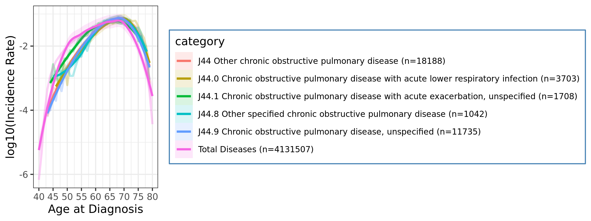 | 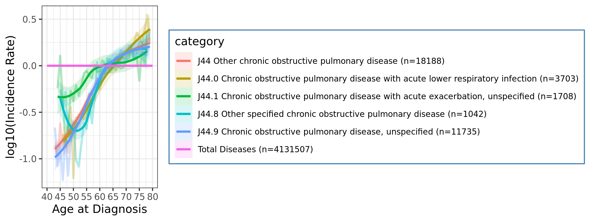 |
| I21 Acute myocardial infarction (Acute MI)                   |  |  |
| I22 Subsequent myocardial infarction (Subsequent MI)         |  |  |
| I64 Stroke, not specified as haemorrhage or infarction  1432 |  | 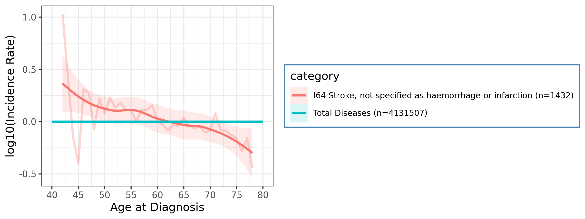 |
| E11 Non-insulin-dependent diabetes mellitus (Diabetes Type II) |  |  |
| E14 Unspecified diabetes mellitus (Unspecified Diabetes)     |  |  |


## 2. Preprocessing for ICD-10

Calculating incidence of each ICD10 code.

```R
library(dplyr)

# Read data
#totalage_freq = readRDS('Jinhee Code/totalage_freq.rds')
master6          = readRDS("Jinhee Code/master_6.rds")
master6_icd10    = subset(master6,ICD9.ICD10=='ICD10')
ICD10_Code_ann   = read.delim('ICD10_DataCoding_41270.tsv')
total_icd10_freq = readRDS('total_icd10_freq.rds')

# Calculate normalized incidence rate of ICD10
icd10 = master6_icd10$Disease_Code %>% as.character %>% unique %>% sort

# Run clustering_preprocess
## Minimum incidence criteria: 200
source('src/ard.r')
clust_result = clustering_preprocess(
    master         = master6_icd10,
    code_num       = icd10,
    code_ann       = ICD10_Code_ann,
    totalage_freq  = total_icd10_freq,
    subgroup       = FALSE)

saveRDS(clust_result,'clust_result_icd10.rds')

# debugging for 6963/11726 O16
#source('10. Automation_ICD10_UKB.r'); clust_result = clustering_preprocess(master6_icd10, "O16", ICD10_Code_ann, total_icd10_freq, FALSE)
```

> ** Run clustering_preprocess **
>
> Processing 11726 iterations:
>
>
>   100/11726 A392 Job process: 33.9 sec
>
>   200/11726 B000 Job process: 1.1 min
>
> ...
>
>   11600/11726 Z851 Job process: 1.3 hr
>
>   11700/11726 Z961 Job process: 1.3 hr
>
> Merging data = 41  2090 -> done
>
> Job done: 2021-02-13 20:31:55 for 1.3 hr


## 3. Draw heatmap of ICD-10 normalized incidences

* [See R color palette](https://kbroman.files.wordpress.com/2014/05/crayons.png)
* `library(colorspace)` [ref](https://www.r-bloggers.com/2019/01/colorspace-new-tools-for-colors-and-palettes/), [fig](https://i2.wp.com/eeecon.uibk.ac.at/~zeileis/assets/posts/2019-01-14-colorspace/hcl-palettes-1.png?ssl=1)

```R
library(dplyr)
library(ComplexHeatmap)

# Read data
clust_result = readRDS('clust_result_icd10.rds')

# Prepare sub-sets
## clust_result:  41 2089; original data
## clust_result2: 41  873; peak age over 60
## clust_result3: 36  784; peak age over 60 & remove top 1 and bottom 2 rows (< 1,500 incidences)
source('src/ard.r')
clust_result2 = subsetting_cluster_result(clust_result, 0,0, 60)
clust_result3 = subsetting_cluster_result(clust_result, 4,2, 60)
col_fun = colorRamp2(c(0,1,2,3,4,7,10), c("white","Sky Blue","yellow Green","yellow","red","purple","black"))
```

Draw total 2,089 ICD-10 diseases heatmap

```R
png('fig/clust_result.png', width=25,height=8, units='in', res=150)
Heatmap(clust_result, cluster_rows = FALSE, col = col_fun, column_dend_height=unit(1.5,'in'))
dev.off()
```


Draw 873 diseases filtered by peak age after 60 years

```R
png('fig/clust_result_peak60.png', width=25,height=8, units='in', res=150)
Heatmap(clust_result2, cluster_rows = FALSE, col = col_fun, column_dend_height=unit(1.5,'in'))
dev.off()
```


Draw 784 diseases with peak age after 60 years and removed top 4 and bottom 2 rows (< 1,500 incidences)

```R
# set configurations
i = 3
wh = c(25,8)
col_split = c(8,12,20)
f_name = paste0('fig/clust_result_peak60_2,4trimed_',col_split[i],'.png')

# Draw heatmaps
png(f_name, width=25,height=8, units='in', res=150)
Heatmap(clust_result3, cluster_rows = FALSE, col = col_fun, column_split = col_split[i], column_dend_height=unit(1.5,'in'))
dev.off()

# Kill all graphics objects
graphics.off()
```


## 4. Extract clustered data & draw cluster plots

Split normalized incidence rate data by hclust

```R
k = 20
f_name = paste0('fig/clust_result_peak60_2,4trimed_',k,'-re.png')
code_nm = 'ICD-10'
split = data.frame(cutree(hclust(dist(t(clust_result3))), k = k))
split[,2] = rownames(split)
colnames(split) = c('cluster',code_nm)

png(f_name, width=25,height=7, units='in', res=150)
Heatmap(clust_result3, column_split=split[,1], cluster_rows=FALSE, col=col_fun, column_dend_height=unit(1.5,'in'))
dev.off()
```

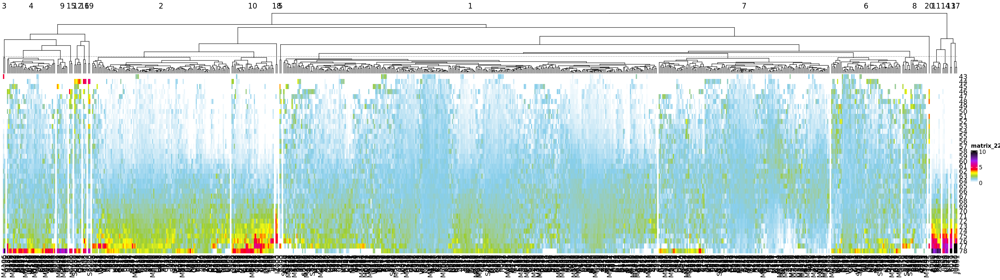

Draw correlation matrix

```R
library(corrplot)
cor_mat = cor(clust_result3, method="spearman")
f_name = paste0('fig/clust_result_peak60_2,4trimed_',k,'-corr.png')

png(f_name, width=25,height=25, units='in', res=150)
corrplot(cor_mat, method='square', tl.col="black", order="hclust", tl.cex=0.7)
dev.off()
```


Prepare normalized incidence rate data list by cluster

```R
source('src/ard.r')
dis_cluster = normalized_by_cat(
    master         = master6_icd10,
    cat_code       = split,
    ICD10_Code_ann = ICD10_Code_ann,
    totalage_freq  = total_icd10_freq,
    subgroup       = FALSE)
```

> ** Run normalized_by_cat **
>
> Processing 20 iterations:
>   1/20 1 = 317 -> 10306 4; Job process: 3.5 min
>   2/20 2 = 117 -> 3490 4; Job process: 4.9 min
>   3/20 3 = 2 -> 88 4; Job process: 4.9 min
>   4/20 4 = 41 -> 1335 4; Job process: 5.3 min
>   5/20 5 = 2 -> 101 4; Job process: 5.3 min
>   6/20 6 = 59 -> 2010 4; Job process: 6 min
>   7/20 7 = 145 -> 4662 4; Job process: 7.6 min
>   8/20 8 = 21 -> 683 4; Job process: 7.8 min
>   9/20 9 = 9 -> 314 4; Job process: 7.9 min
>   10/20 10 = 36 -> 1017 4; Job process: 8.4 min
>   11/20 11 = 8 -> 214 4; Job process: 8.5 min
>   12/20 12 = 6 -> 245 4; Job process: 8.5 min
>   13/20 13 = 2 -> 82 4; Job process: 8.5 min
>   14/20 14 = 5 -> 157 4; Job process: 8.6 min
>   15/20 15 = 3 -> 127 4; Job process: 8.6 min
>   16/20 16 = 3 -> 132 4; Job process: 8.7 min
>   17/20 17 = 3 -> 95 4; Job process: 8.7 min
>   18/20 18 = 2 -> 76 4; Job process: 8.7 min
>   19/20 19 = 2 -> 107 4; Job process: 8.8 min
>   20/20 20 = 1 -> 69 4; Job process: 8.8 min

Draw normalized incidence rate as line plot by cluster

```R
source('src/ard.r')
for (i in 1:length(dis_cluster)) {
    dataplotting_multi(
        dis_cluster[[i]],
        cut_top = 4,
        cut_bottom = 2,
        out='fig/icd10_cluster_20'
    )
}
```

|   |   |   |   |
| -------------------------------------------------------- | -------------------------------------------------------- | -------------------------------------------------------- | -------------------------------------------------------- |
|   |   |   |   |
|   |  |  |  |
|  |  |  |  |
|  |  |  |  |


# Age-related diseases: Phecode

## 1. Calculating phecode background incidence

Preparing total incidence of Phecode data as background. Save the result as RDS file for later use.

```R
library(dplyr)

# Read data
master6 <- readRDS("Jinhee Code/master_6.rds")
phecodes = read.delim("phecode-ukbb-agg.tsv",stringsAsFactors=F)
phecodes$phecode <- sprintf("%.2f", phecodes$phecode)

# Extract ICD codes & data
phecode_icds = c(phecodes$icd9_ukb,phecodes$icd10_ukb)
phecode_icd = strsplit(phecode_icds,'\\, ') %>% unlist %>% unique
master6_phecode = subset(master6, Disease_Code %in% phecode_icd)

# Calculate the total incidence of Phecode
source('src/ard.r')
total_phecode_freq = original(
    master6_phecode, 
    code_num=NULL, 
    code_ann=NULL, 
    totalage_freq=NULL,
    subgroup=FALSE)[[1]]

# Save as RDS file
saveRDS(total_phecode_freq,'total_phecode_freq.rds')

# Create barplot of total phecode disease incidences
total_phecode_freq_vec = total_phecode_freq$Frequency
names(total_phecode_freq_vec) = total_phecode_freq$`Age at Diagnosis`
png('fig/phecode/total_phecode_freq.png')
barplot(total_phecode_freq_vec,main='Total phecode incidences',xlab='Age at Diagnosis')
dev.off()
```

> dim(master6)
> [1] 4234599       9
> dim(master6_phecode)
> [1] 3388553       9

Phecode covers 3.4M records (80% of total 4.2M records) with age range 27-80 years old.


### Examples: Age-related diseases

Draw incidence rate plot for major age-related diseases and its subgroups.

* 290	Delirium dementia and amnestic and other cognitive disorders
  * 290.1 Dementias
  * **290.11 Alzheimer's disease**
  * 290.12 Dementia with cerebral degenerations
  * 290.16 Vascular dementia
  * 290.2 Delirium due to conditions classified elsewhere
  * 290.3 Other persistent mental disorders due to conditions classified elsewhere
* 428	Congestive heart failure; nonhypertensive
  * 428.1 Congestive heart failure (CHF) NOS
  * 428.2 Heart failure NOS
* No - Chronic obstructive pulmonary disease (COPD)
* 411	Ischemic Heart Disease
  * 411.1 Unstable angina (intermediate coronary syndrome)
  * 411.2 Myocardial infarction
  * 411.3 Angina pectoris
  * 411.4 Coronary atherosclerosis
  * 411.41 Aneurysm and dissection of heart
  * 411.8 Other chronic ischemic heart disease, unspecified
  * 411.9 Other acute and subacute forms of ischemic heart disease
* Stroke, haemorrage or infarction
* 433	Cerebrovascular disease
  * 433.1 Occlusion and stenosis of precerebral arteries
  * 433.11 Occlusion of cerebral arteries, with cerebral infarction
  * 433.12 Cerebral atherosclerosis
  * 433.2 Occlusion of cerebral arteries
  * 433.21 Cerebral artery occlusion, with cerebral infarction
  * 433.3 Cerebral ischemia
  * 433.31 Transient cerebral ischemia
  * 433.32 Moyamoya disease
  * 433.5 Cerebral aneurysm
  * 433.8 Late effects of cerebrovascular disease
* 250.2	Type 2 diabetes
  * 250.21	Type 2 diabetes with ketoacidosis
  * 250.22	Type 2 diabetes with renal manifestations
  * 250.23	Type 2 diabetes with ophthalmic manifestations
  * 250.24	Type 2 diabetes with neurological manifestations
* 250.1	Type 1 diabetes

```R
library(dplyr)

# Read data
master6 <- readRDS("Jinhee Code/master_6.rds")
phecodes = read.delim("phecode-ukbb-agg.tsv",stringsAsFactors=F)
phecodes$phecode <- sprintf("%.2f", phecodes$phecode)
total_phecode_freq = readRDS('total_phecode_freq.rds')

phecode_icds = c(phecodes$icd9_ukb,phecodes$icd10_ukb)
phecode_icd = strsplit(phecode_icds,'\\, ') %>% unlist %>% unique
phecode_icd = str_replace_all(phecode_icd, "[^[:alnum:]]", "")
master6_phecode = subset(master6, Disease_Code %in% phecode_icd)

# Set configurations
source('src/ard.r')
ards_phecodes = c("290","428","411","433","250.1","250.2")
f_dir = 'fig/phecode'

for(i in 1:length(ards_phecodes)) {
    # Prepare data
    inc_rate = original_phecode(
        master6_phecode, 
        code_num=ards_phecodes[i], 
        code_ann=phecodes, 
        freq=200,
        totalage_freq=total_phecode_freq)
    inc_norm = normalized_phecode(
        master6_phecode, 
        code_num=ards_phecodes[i], 
        code_ann=phecodes, 
        freq=200,
        totalage_freq=total_phecode_freq)
    
   # Draw plots
    dataplotting(inc_rate,logbase=10,age_min=27,age_max=80,f_dir)
    dataplotting(inc_norm,logbase=10,age_min=27,age_max=80,f_dir)
}
```

> ** Run original_phecode **
>
> Processing 5 iterations:
> 250.10 Type 1 diabetes, N = 4000 (25001,25011,E100,E106,E107,E108,E109)
> 250.11 Type 1 diabetes with ketoacidosis, N = 378 (25011,E101)
> 250.12 Type 1 diabetes with renal manifestations, N = 130 (E102)
> 250.13 Type 1 diabetes with ophthalmic manifestations, N = 711 (E103)
> 250.14 Type 1 diabetes with neurological manifestations, N = 253 (E104)
>
> ** Run original_phecode **
>
> Processing 5 iterations:
> 250.20 Type 2 diabetes, N = 32951 (25000,25010,E110,E116,E117,E118,E119,E135,E136,E137,E138,E139,E149)
> 250.21 Type 2 diabetes with ketoacidosis, N = 236 (2501,E111,E131)
> 250.22 Type 2 diabetes with renal manifestations, N = 394 (E112)
> 250.23 Type 2 diabetes with ophthalmic manifestations, N = 2572 (E103,E113)
> 250.24 Type 2 diabetes with neurological manifestations, N = 1399 (E104,E114,E134,G590)
>
> ...

| Disease                                                      | Incidence rate                         | Normalized incidence rate                |
| ------------------------------------------------------------ | -------------------------------------- | ---------------------------------------- |
| 250.1 Type 1 diabetes                                        | 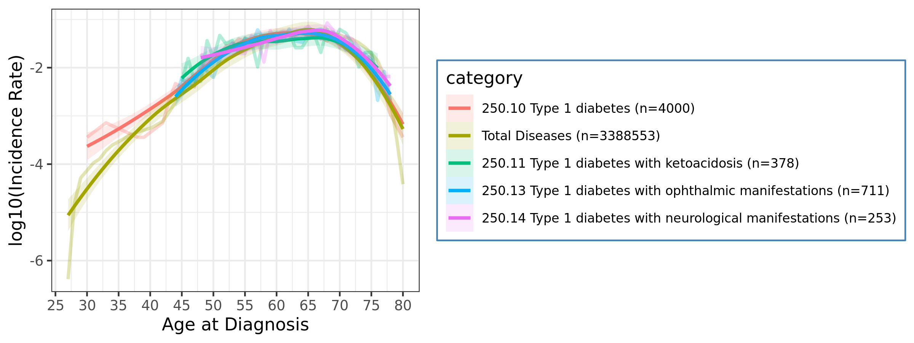 | 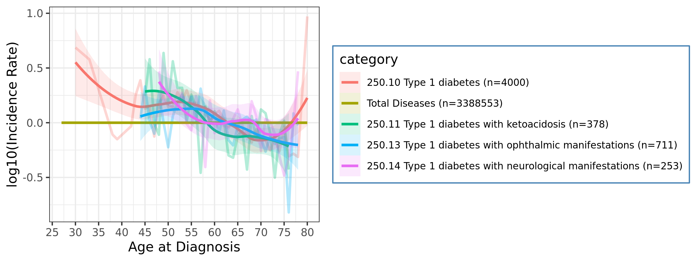 |
| 250.2 Type 2 diabetes                                        | 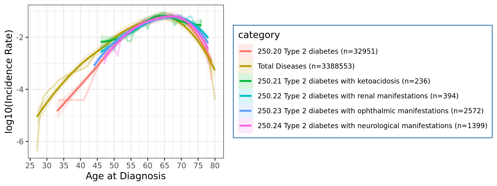 | 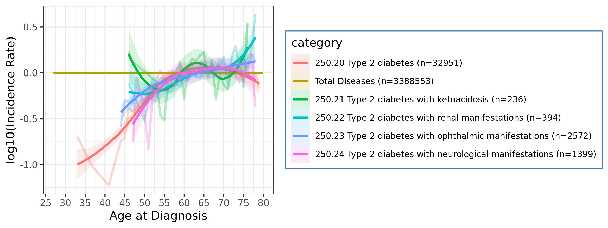 |
| 290 Delirium dementia and amnestic and other cognitive disorders | 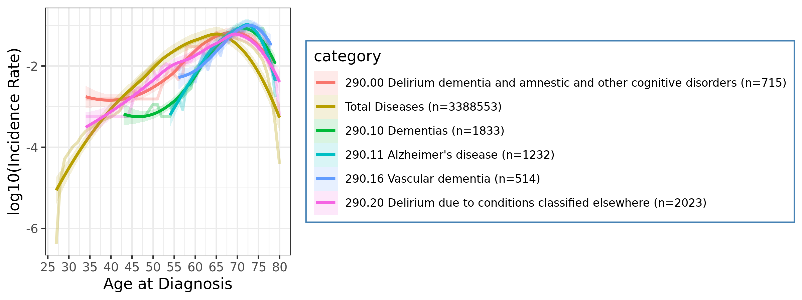   | 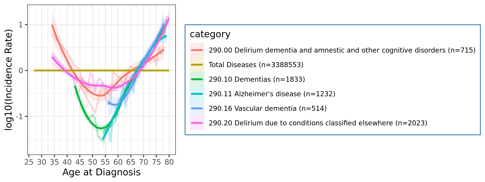   |
| 411 Ischemic Heart Disease                                   | 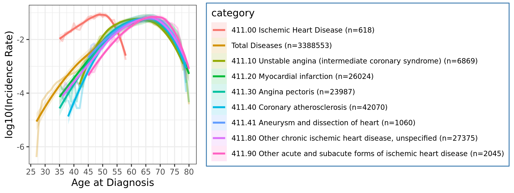   | 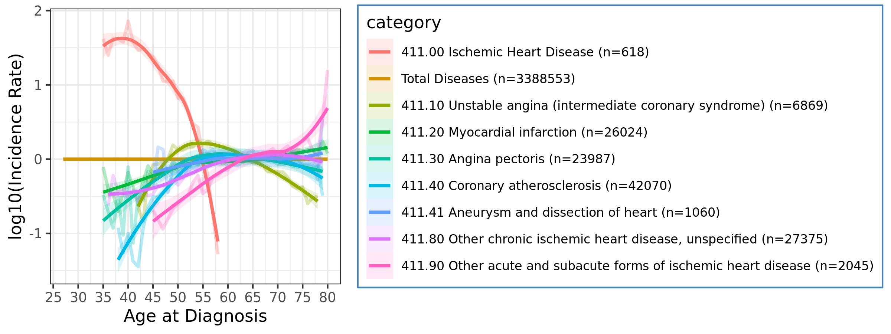   |
| 428 Congestive heart failure; nonhypertensive                | 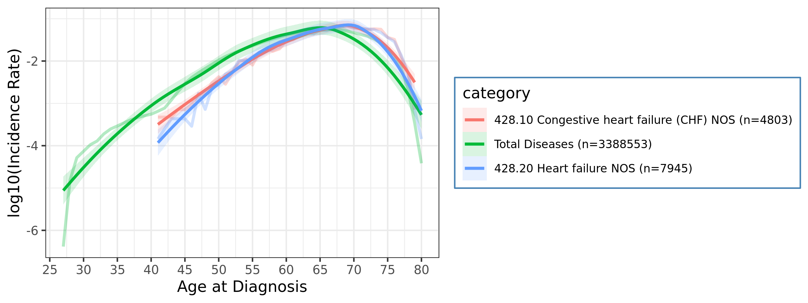   | 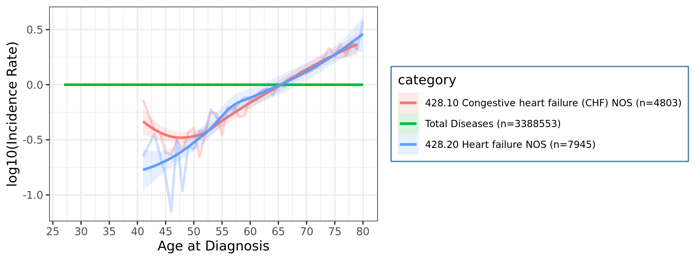   |
| 433 Cerebrovascular disease                                  | 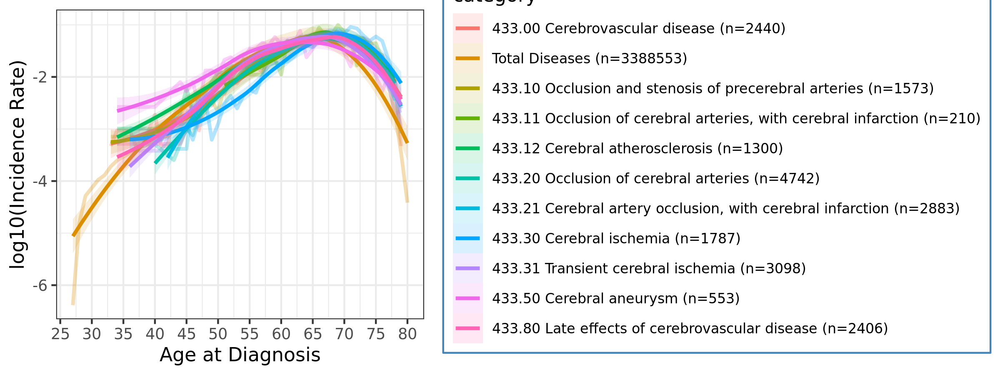   | 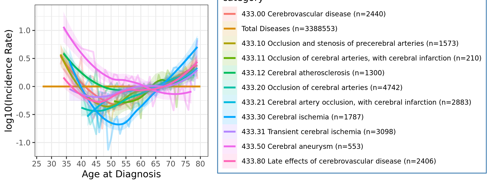   |


## 2. Preprocessing for Phecode

Calculating incidence of each Phecode.

```R
library(dplyr)

# Read data
master6 <- readRDS("Jinhee Code/master_6.rds")
phecodes = read.delim("phecode-ukbb-agg.tsv",stringsAsFactors=F)
phecode_codes = sprintf("%.2f", phecodes$phecode)
phecodes$phecode = phecode_codes
total_phecode_freq = readRDS('total_phecode_freq.rds')

phecode_icds = c(phecodes$icd9_ukb,phecodes$icd10_ukb)
phecode_icd = strsplit(phecode_icds,'\\, ') %>% unlist %>% unique
phecode_icd = str_replace_all(phecode_icd, "[^[:alnum:]]", "") %>% sort
master6_phecode = subset(master6, Disease_Code %in% phecode_icd)

# Run clustering_preprocess
## Minimum incidence criteria: 200
source('src/ard.r')
clust_result_phecode = clustering_preprocess_phecode(
    master         = master6_phecode,
    code_num       = phecode_codes,
    code_ann       = phecodes,
    freq           = 200,
    totalage_freq  = total_phecode_freq)

saveRDS(clust_result_phecode,'clust_result_phecode.rds')
```

> ...
>
>   1674/1674 1100.00 Job process: 8.7 min
>
> Merging data = 54  1041 -> done
>
> Job done: 2021-02-21 03:58:02 for 8.8 min


## 3. Draw heatmap of Phecode

```R
library(dplyr)
library(ComplexHeatmap)
library(circlize)

# Read data
clust_result_phecode = readRDS('clust_result_phecode.rds')

# Prepare sub-sets
## clust_result_phecode:  54 1,040; original data
## clust_result_phecode2: 54   365; peak age over 60
## clust_result_phecode3: 52   318; peak age over 60 & remove bottom 2 rows (< 1,500 incidences)
source('src/ard.r')
clust_result_phecode2 = subsetting_cluster_result(clust_result_phecode, 0,0, 60)
clust_result_phecode3 = subsetting_cluster_result(clust_result_phecode, 0,2, 60)
col_fun = colorRamp2(c(0,1,2,3,4,7,10), c("white","Sky Blue","yellow Green","yellow","red","purple","black"))
```

Draw total 1,040 Phecode diseases heatmap

```R
png('fig/phecode/clust_result_phecode.png', width=25,height=8, units='in', res=150)
Heatmap(clust_result_phecode, cluster_rows = FALSE, col = col_fun, column_dend_height=unit(1.5,'in'))
dev.off()
```


Draw 365 diseases filtered by peak age after 60 years

```R
png('fig/phecode/clust_result_phecode_peak60.png',
    	width=25,height=8, units='in', res=150)
Heatmap(clust_result_phecode2, cluster_rows = FALSE, col = col_fun, column_dend_height=unit(1.5,'in'))
dev.off()
```


Draw 316 diseases with peak age after 60 years and removed top 4 and bottom 2 rows (< 1,500 incidences)

```R
# set configurations
i = 3
wh = c(25,8)
col_split = c(8,12,20)
f_name = paste0('fig/phecode/clust_result_phecode_peak60_bt2trimed_',col_split[i],'.png')

# Draw heatmaps
png(f_name, width=25,height=8, units='in', res=150)
Heatmap(clust_result_phecode3, cluster_rows = FALSE, col = col_fun, column_split = col_split[i], column_dend_height=unit(1.5,'in'))
dev.off()

# Kill all graphics objects
graphics.off()
```


## 4. Extract clustered data & draw cluster plots

Split normalized incidence rate data by hclust

```R
k = 20
f_name = paste0('fig/phecode/clust_result_phecode_peak60_bt2trimed_',k,'-re.png')
code_nm = 'Phecode'
split_phecode = data.frame(cutree(hclust(dist(t(clust_result_phecode3))), k = k))
split_phecode[,2] = rownames(split_phecode)
colnames(split_phecode) = c('cluster',code_nm)

png(f_name, width=26,height=8, units='in', res=150)
Heatmap(clust_result_phecode3, column_split=split_phecode[,1], cluster_rows=FALSE, col=col_fun, column_dend_height=unit(1.5,'in'))
dev.off()
```


Prepare normalized incidence rate data list by cluster

```R
source('src/ard.r')
dis_cluster_phecode = normalized_by_cat_phecode(
    master         = master6_phecode,
    cat_code       = split_phecode,
    code_ann       = phecodes,
    totalage_freq  = total_phecode_freq,
    subgroup       = FALSE)
```

> ** Run normalized_by_cat **
>
> Processing 20 iterations:
>   1/20 1 = 58 -> dim  2211 4; Job process: 20.6 sec
>   2/20 2 = 53 -> dim  1838 4; Job process: 30.7 sec
>   3/20 3 = 81 -> dim  2974 4; Job process: 54.8 sec
>   4/20 4 = 1 -> dim  86 4; Job process: 54.9 sec
>   5/20 5 = 11 -> dim  422 4; Job process: 58 sec
>   6/20 6 = 19 -> dim  637 4; Job process: 1 min
>   7/20 7 = 47 -> dim  1653 4; Job process: 1.2 min
>   8/20 8 = 15 -> dim  520 4; Job process: 1.3 min
>   9/20 9 = 6 -> dim  242 4; Job process: 1.3 min
>   10/20 10 = 7 -> dim  300 4; Job process: 1.3 min
>   11/20 11 = 2 -> dim  130 4; Job process: 1.3 min
>   12/20 12 = 5 -> dim  203 4; Job process: 1.3 min
>   13/20 13 = 1 -> dim  75 4; Job process: 1.3 min
>   14/20 14 = 1 -> dim  87 4; Job process: 1.3 min
>   15/20 15 = 1 -> dim  85 4; Job process: 1.3 min
>   16/20 16 = 2 -> dim  108 4; Job process: 1.4 min
>   17/20 17 = 2 -> dim  117 4; Job process: 1.4 min
>   18/20 18 = 2 -> dim  119 4; Job process: 1.4 min
>   19/20 19 = 1 -> dim  98 4; Job process: 1.4 min
>   20/20 20 = 1 -> dim  87 4; Job process: 1.4 min

Draw normalized incidence rate as line plot by cluster

```R
source('src/ard.r')
for (i in 1:length(dis_cluster_phecode)) {
    dataplotting_multi(
        dis_cluster_phecode[[i]],
        cut_top    = 0,
        cut_bottom = 2,
        out = 'fig/phecode_cluster_20'
    )
}
```

|   |   |   |   |
| ---------------------------------------------------------- | ---------------------------------------------------------- | ---------------------------------------------------------- | ---------------------------------------------------------- |
|   |   |   |   |
|   |  |  |  |
|  |  |  |  |
|  |  |  |  |


# Death (ICD-10)