# Summary of master 7

Using Master 7 data

```r
library(dplyr)
master7 = readRDS('master_7.rds')
ICD10_Code_ann = read.delim('ICD10_DataCoding_41270.tsv')
dim(master7)
head(master7)
```
```
[1] 4234599      10

      eid Disease_Code ICD9.ICD10 Disease_Date   content   birthday
1 1000010         Z800      ICD10   2001-06-21 Secondary 1941-07-01
2 1000010         N359      ICD10   1999-05-04      Main 1941-07-01
3 1000010         Z861      ICD10   2013-07-24 Secondary 1941-07-01
4 1000010         G459      ICD10   2016-10-30      Main 1941-07-01
5 1000010          R05      ICD10   2014-06-07 Secondary 1941-07-01
6 1000010         Z881      ICD10   2013-08-12 Secondary 1941-07-01
  Diagnosed_age                                                        meaning
1      60.01370 Z80.0 Family history of malignant neoplasm of digestive organs
2      57.87945                          N35.9 Urethral stricture, unspecified
3      72.11233    Z86.1 Personal history of infectious and parasitic diseases
4      75.38356         G45.9 Transient cerebral ischaemic attack, unspecified
5      72.98356                                                      R05 Cough
6      72.16438   Z88.1 Personal history of allergy to other antibiotic agents
  gender Recruited_age
1 Female            67
2 Female            67
3 Female            67
4 Female            67
5 Female            67
6 Female            67
```

```r
unique(master7$eid) %>% length
```
> [1] 457982

Split data by ICD version

```r
master7_icd9 = subset(master7,ICD9.ICD10=='ICD9')
master7_icd10 = subset(master7,ICD9.ICD10=='ICD10')

unique(master7_icd9$Disease_Code) %>% length
unique(master7_icd10$Disease_Code) %>% length
```
> [1] 3337
> [1] 11726

```r
unique(master7_icd9$eid) %>% length
unique(master7_icd10$eid) %>% length
```
> [1] 20303
> [1] 410336

```r
dis_10_freq = table(master7_icd10$Disease_Code) %>% as.data.frame
dis_10_freq_0 = subset(dis_10_freq,Freq>0)
dis_10_freq_200 = subset(dis_10_freq, Freq>200)

png('fig/hist_icd10_dis.png')
hist(dis_10_freq_0$Freq, main="ICD-10 disease records", breaks=20, xlab="Record number", ylab="Disease number")
dev.off()

png('fig/hist_icd10_dis_200.png')
hist(dis_10_freq_200$Freq, main="ICD-10 disease records (>200)", breaks=20, xlab="Record number", ylab="Disease number")
dev.off()
```


```R
dis_9_freq = table(master7_icd9$Disease_Code) %>% as.data.frame
dis_9_freq_0 = subset(dis_9_freq, Freq>0)
dis_9_freq_200 = subset(dis_9_freq, Freq>200)

png('fig/hist_icd9_dis.png')
hist(dis_9_freq_0$Freq, main="ICD-9 disease records", breaks=20, xlab="Record number", ylab="Disease number")
dev.off()

png('fig/hist_icd9_dis_200.png')
hist(dis_9_freq_200$Freq, main="ICD-9 disease records (>200)", breaks=20, xlab="Record number", ylab="Disease number")
dev.off()
```

| Total ICD-10 diseases       | ICD-10 diseases >200 records    |
| --------------------------- | ------------------------------- |
| fig/hist_icd10_dis.png      | fig/hist_icd10_dis_200.png      |
| 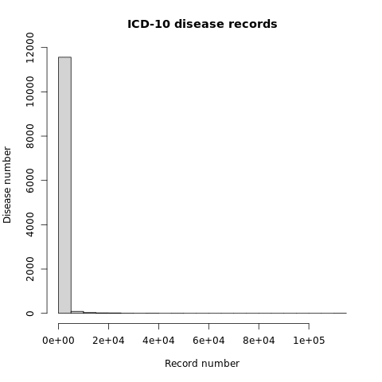 | 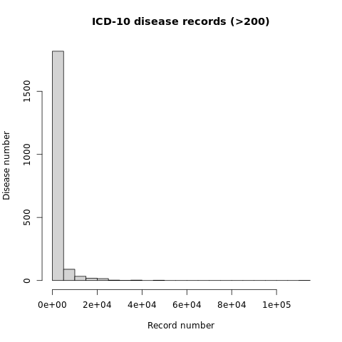 |
| fig/hist_icd9_dis.png       | fig/hist_icd9_dis_200.png       |
| 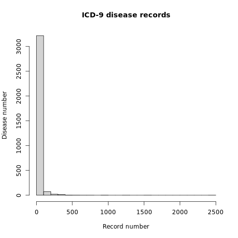  | 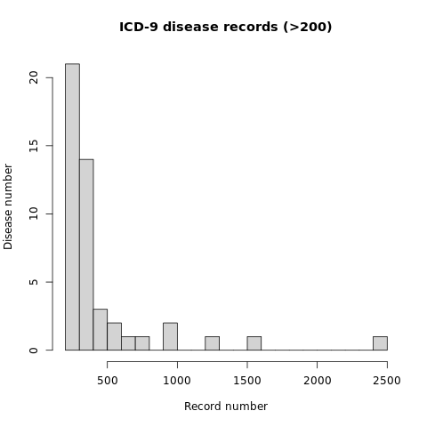  |


Filter diseases only have >200 records

```R
master7_icd9_200 = subset(master7_icd9, Disease_Code %in% dis_9_freq_200$Var1)
master7_icd10_200 = subset(master7_icd10, Disease_Code %in% dis_10_freq_200$Var1)

unique(master7_icd9_200$eid) %>% length
unique(master7_icd10_200$eid) %>% length
```
> [1] 13064
> [1] 407519


## Prepare distribution of age at recruitment

```R
recruite = read.delim('fid21022_age_at_recruitement.tsv')
dim(recruite)
```
> [1] 308317      2

```R
# Overlap with EMR data
master7_icd10_rec = master7_icd10 %>% select(eid,Recruited_age)
master7_icd10_rec = na.omit(master7_icd10_rec) %>% unique
dim(master7_icd10_rec)
head(master7_icd10_rec)

master7_icd9_rec = master7_icd9 %>% select(eid,Recruited_age)
master7_icd9_rec = na.omit(master7_icd9_rec) %>% unique
dim(master7_icd9_rec)
head(master7_icd9_rec)
```
```
[1] 262472      2
        eid Recruited_age
1   1000010            67
90  1000034            62
94  1000052            58
114 1000076            68
155 1000120            70
181 1000171            69

[1] 12650     2
         eid Recruited_age
384  1000384            60
389  1000406            61
692  1000672            66
833  1000856            57
1051 1001063            55
1862 1002029            63
```

```R
png('fig/hist_icd_10_person.png')
hist(master7_icd10_rec$Recruited_age, main="ICD-10 disease person level", xlab="Age", ylab="Patient number")
dev.off()

png('fig/hist_icd_9_person.png')
hist(master7_icd9_rec$Recruited_age, main="ICD-9 disease person level", xlab="Age", ylab="Patient number")
dev.off()
```

| fig/hist_icd_10_person.png      | fig/hist_icd_9_person.png      |
| ------------------------------- | ------------------------------ |
| 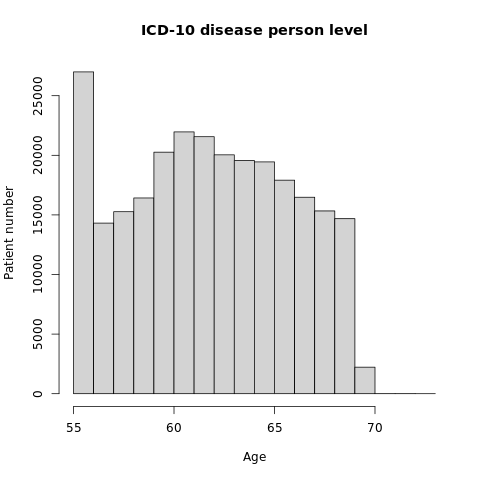 | 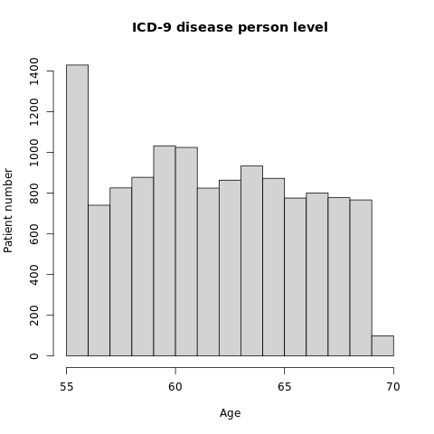 |


# Total disease: person count

* This is a distribution of very first disease record from any diseases

```R
# Not finished this step
source('src/pdtime.r')
t0 = Sys.time()

source('src/ard.r')
out_dir = 'fig/icd10_person'
icd10_very_first = original_person(
	master7_icd10, code_ann=ICD10_Code_ann, code_num=NULL, freq=200)
plot_person(icd10_very_first, age_min=40, age_max=80, out_dir)

pdtime(t0,1) %>% cat
```


* This is a distribution of first disease record for every diseases

```R
# Not finished this step
# Get disease list in ICD-10
icd10_codes = master7_icd10_200$Disease_Code %>% unique %>% sort

# Run function
source('src/pdtime.r')
t0 = Sys.time()

source('src/ard.r')
out_dir = 'fig/icd10_person'
icd10_first_onset = original_person(
	master7_icd10, 
    code_ann=ICD10_Code_ann, code_num=icd10_codes, 
    group_nm='Total diseases', freq=200)[[1]]
#plot_person(icd10_first_onset, age_min=40, age_max=80, out_dir)

pdtime(t0,1) %>% cat
```


## Age-of-onset distribution

Age-related disease (ARD) examples:
* G30 Alzheimer's disease
* E11 Non-insulin-dependent diabetes mellitus (Diabetes Type II)
* E14 Unspecified diabetes mellitus (Unspecified Diabetes)
* I21 Acute myocardial infarction (Acute MI)
* I22 Subsequent myocardial infarction (Subsequent MI)
* I50 Heart failure (CHF)
* I64 Stroke, not specified as haemorrhage or infarction
* J44 Other chronic obstructive pulmonary disease (COPD)

```R
#icd9_alz = dis_freq(master6_icd9,'290.11',200)
source('src/ard.r')
dis = c("G30", "E11", "E14", "I21", "I22", "I50", "I64", "J44")
out_dir = 'fig/icd10_person'

icd10_ard_li = list()
for(i in 1:length(dis)) {
	paste0(i,' ',dis[i]) %>% cat
	icd10_ard_li[[i]] = original_person(
		master7_icd10, code_ann=ICD10_Code_ann, code_num=dis[i], freq=200)[[1]]
	paste0(' -> done\n') %>% cat
}
icd10_ard_freq = data.table::rbindlist(icd10_ard_li)
icd10_ard = list(icd10_ard_freq, "ARDs", "Disease onset prop")
plot_person(icd10_ard, age_min=40, age_max=80, out_dir)
```

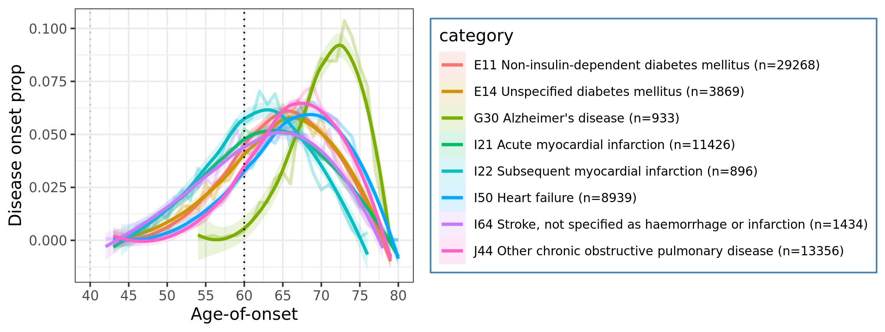


Non-ARD examples:

* G35 Multiple sclerosis
* E10 Insulin-dependent diabetes mellitus

```R
source('src/ard.r')
nonard = c("G35", "E10")
out_dir = 'fig/icd10_person'

icd10_nonard_li = list()
for(i in 1:length(nonard)) {
	paste0(i,' ',dis[i]) %>% cat
	icd10_nonard_li[[i]] = original_person(
		master7_icd10, code_ann=ICD10_Code_ann, code_num=nonard[i], freq=200)[[1]]
	paste0(' -> done\n') %>% cat
}
icd10_nonard_freq = data.table::rbindlist(icd10_nonard_li)
icd10_nonard = list(icd10_nonard_freq, "Non-ARDs", "Disease onset prop")
plot_person(icd10_nonard, age_min=40, age_max=80, out_dir)
```

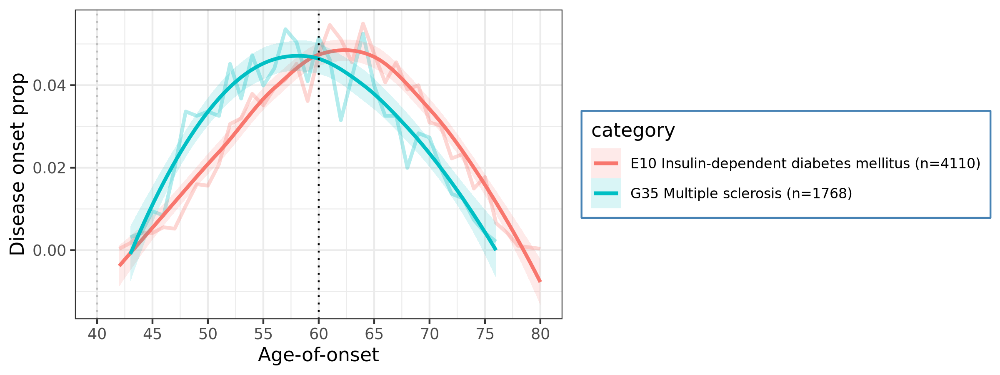


# The Global Burden of Disease (GBD) data display

```R
library(dplyr)
gbd = read.csv('db_gbd/IHME-GBD_2019_DATA-bd315805-1.csv')
dim(gbd)
gbd$sex_name %>% table
gbd$measure_name %>% table
gbd$metric_name %>% table
gbd$cause_name %>% table
```
```
[1] 47160    16

  Both Female   Male 
 15720  15720  15720 

DALYs (Disability-Adjusted Life Years)                                 Deaths 
                                  8100                                   7380 
                             Incidence                             Prevalence 
                                  8100                                   8100 
    YLDs (Years Lived with Disability)              YLLs (Years of Life Lost) 
                                  8100                                   7380 

 Number Percent    Rate 
  15720   15720   15720 

Alzheimer's disease and other dementias                 Cardiovascular diseases
                                   4140                                    4860
  Chronic obstructive pulmonary disease                Diabetes mellitus type 1
                                   4860                                    4860
               Diabetes mellitus type 2                     Idiopathic epilepsy
                                   4590                                    4860
                   Motor neuron disease                      Multiple sclerosis
                                   4860                                    4770
                    Parkinson's disease                                  Stroke
                                   4500                                    4860
```


## Incidence % profile

Filter and display the data

```R
ards = c('Alzheimer\'s disease and other dementias','Cardiovascular diseases','Chronic obstructive pulmonary disease','Diabetes mellitus type 2','Motor neuron disease','Parkinson\'s disease','Stroke')
nonards = c('Diabetes mellitus type 1','Idiopathic epilepsy','Multiple sclerosis')

gbd_inci_perc_2019_ard = subset(gbd, sex_name=='Both'& measure_name=='Incidence' & metric_name=='Percent' & year==2019 & cause_name %in% ards)

source('src/ard.r')
plot_gbd(gbd_inci_perc_2019_ard, ylab_nm="Incidence percent of ARDs", out_dir="db_gbd")

gbd_inci_perc_2019_nonard = subset(gbd, sex_name=='Both'& measure_name=='Incidence' & metric_name=='Percent' & year==2019 & cause_name %in% nonards)

source('src/ard.r')
plot_gbd(gbd_inci_perc_2019_nonard, ylab_nm="Incidence percent of non-ARDs", out_dir="db_gbd")
```

| db_gbd/gbd_Incidence percent of ARDs.png          |
| ------------------------------------------------- |
| 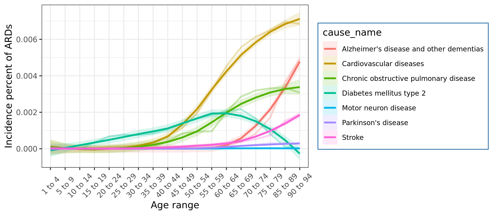     |
| db_gbd/gbd_Incidence percent of non-ARDs.png      |
| 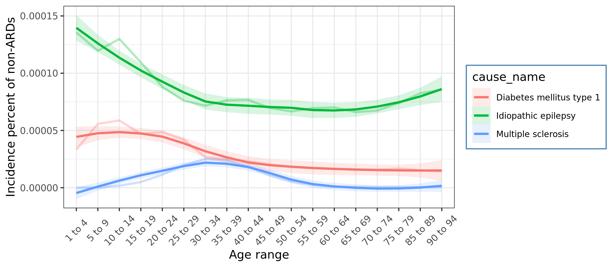 |


## Prevalence % profile

```R
gbd_prev_perc_2019_ard = subset(gbd, sex_name=='Both'& measure_name=='Prevalence' & metric_name=='Percent' & year==2019 & cause_name %in% ards)

source('src/ard.r')
plot_gbd(gbd_prev_perc_2019_ard, ylab_nm="Prevalence percent of ARDs", out_dir="db_gbd")

gbd_prev_perc_2019_nonard = subset(gbd, sex_name=='Both'& measure_name=='Prevalence' & metric_name=='Percent' & year==2019 & cause_name %in% nonards)

source('src/ard.r')
plot_gbd(gbd_prev_perc_2019_nonard, ylab_nm="Prevalence percent of non-ARDs", out_dir="db_gbd")
```

| db_gbd/gbd_Prevalence percent of ARDs.png          |
| -------------------------------------------------- |
| 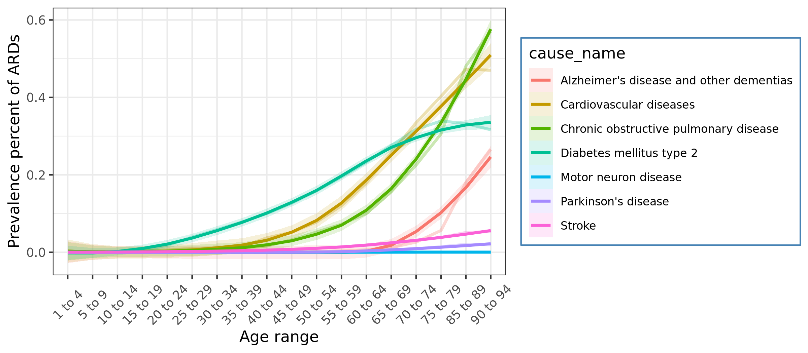     |
| db_gbd/gbd_Prevalence percent of non-ARDs.png      |
| 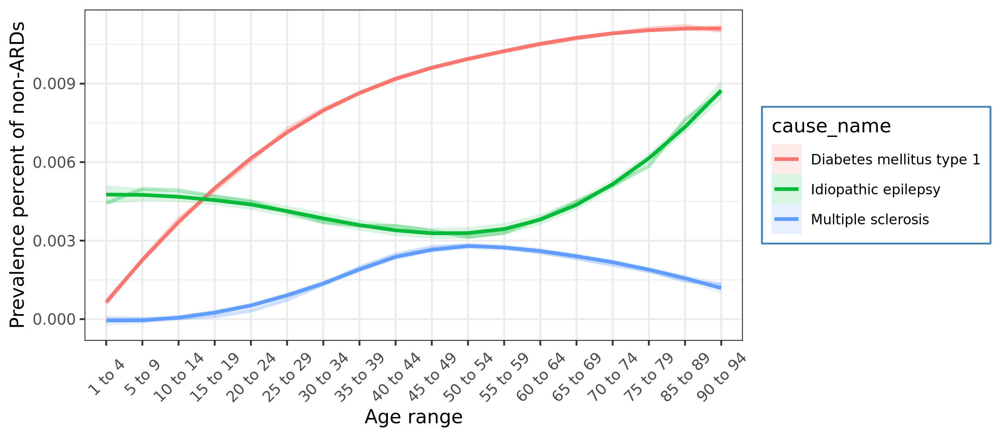 |


## Death % profile

```R
gbd_deaths_perc_2019_ard = subset(gbd, sex_name=='Both'& measure_name=='Deaths' & metric_name=='Percent' & year==2019 & cause_name %in% ards)

source('src/ard.r')
plot_gbd(gbd_deaths_perc_2019_ard, ylab_nm="Death percent of ARDs", out_dir="db_gbd")

gbd_deaths_perc_2019_nonard = subset(gbd, sex_name=='Both'& measure_name=='Deaths' & metric_name=='Percent' & year==2019 & cause_name %in% nonards)

source('src/ard.r')
plot_gbd(gbd_deaths_perc_2019_nonard, ylab_nm="Death percent of non-ARDs", out_dir="db_gbd")
```

```R
gbd_measure = gbd %>% select(measure_id,measure_name) %>% unique
```
```
      measure_id                           measure_name
1              1                                 Deaths
7381           2 DALYs (Disability-Adjusted Life Years)
15481          4              YLLs (Years of Life Lost)
22861          3     YLDs (Years Lived with Disability)
30961          5                             Prevalence
39061          6                              Incidence
```

| db_gbd/gbd_Death percent of ARDs.png          |
| --------------------------------------------- |
| 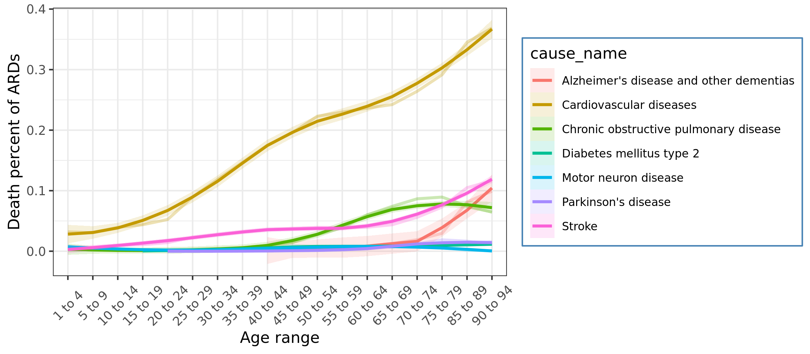     |
| db_gbd/gbd_Death percent of non-ARDs.png      |
| 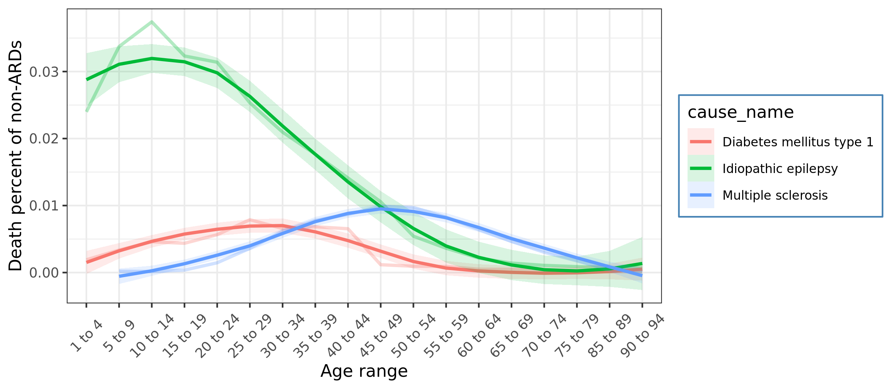 |


## DALYs number profile

```R
gbd_dalys_num_2019_ard = subset(gbd, sex_name=='Both'& measure_id==2 & metric_name=='Number' & year==2019 & cause_name %in% ards)

source('src/ard.r')
plot_gbd(gbd_dalys_num_2019_ard, ylab_nm="DALYs of ARDs", out_dir="db_gbd")

gbd_dalys_num_2019_nonard = subset(gbd, sex_name=='Both'& measure_id==2 & metric_name=='Number' & year==2019 & cause_name %in% nonards)

source('src/ard.r')
plot_gbd(gbd_dalys_num_2019_nonard, ylab_nm="DALYs of non-ARDs", out_dir="db_gbd")
```

| db_gbd/gbd_DALYs of ARDs.png          |
| ------------------------------------- |
| 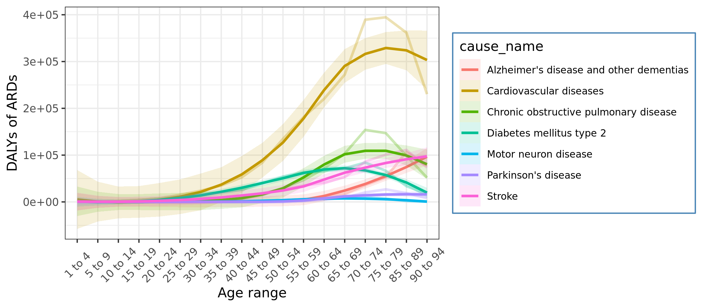     |
| db_gbd/gbd_DALYs of non-ARDs.png      |
| 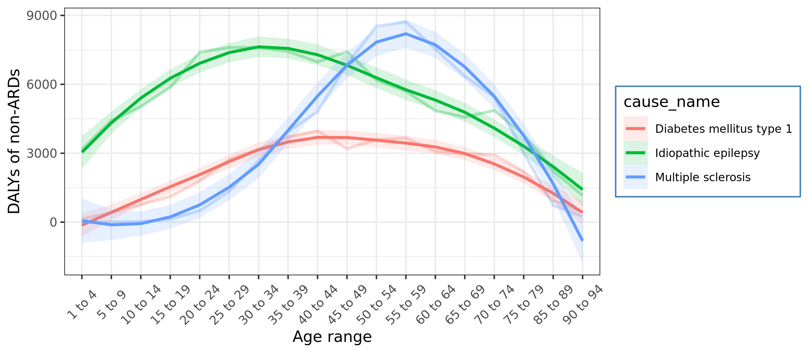 |

